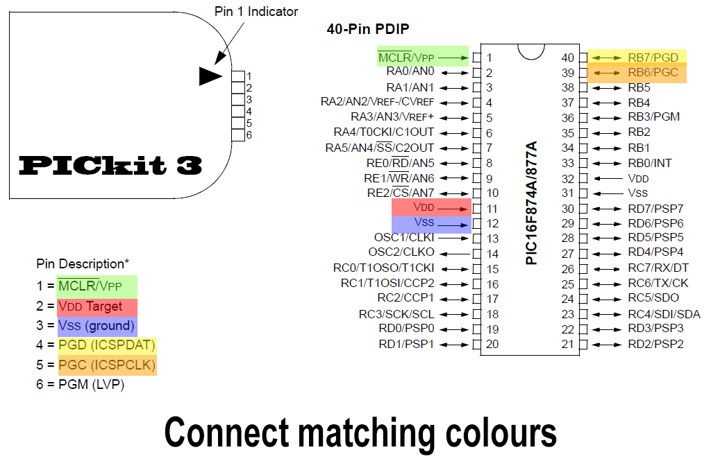
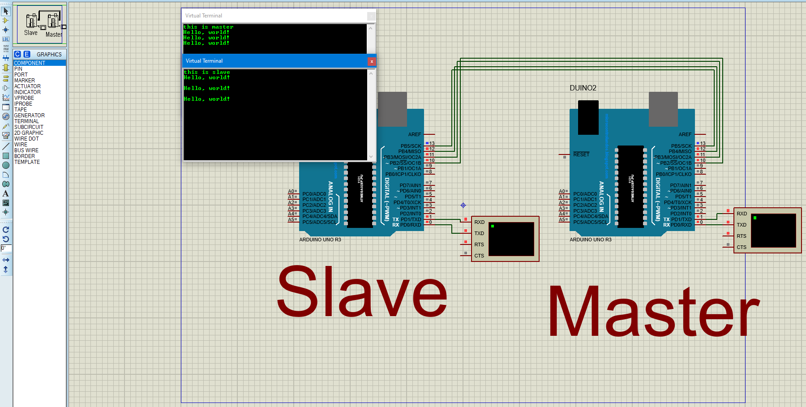

# CSE4 Lab: Communication between 2 Microcontrollers

## 1.	Introduction:

    Communication between multiple controllers is almost a must when it comes to large projects.
    So, in this Lab we’ll investigate in brief the use of the atmega32L, PIC16F877a 
    and the Arduino Uno in some communication scenarios.
    Also come across a few widely used communication protocols such as I2C, SPI.

## 2.	Objectives

    • Explore the communication between multiple microcontrollers.
    • Use Atmel Studio IDE 7.0.
    • Using MPLAB® X IDE v5 for the pic controller.
    • Using Proteus as a simulator for such a communication.
    • Use the Arduino Serial Plotter.

## 3.	Requirements

  ### SW requirements:
    • Proteus 8 Professional (or higher compatible versions)
    • Atmel Studio IDE 7(or any compatible 3rd party IDE)
    • MPLAB IPE v5 (or any other compatible 3rd party software) 
    
  ### HW requirements:
    • PIC16F877A
    • PICkit 3 Programmer (or any other working programmer)
    • Crystal 4.000 MHz
    • Arduino Uno
    • Atmega32L
    • Arduino Serial cable
    • Multiple male-male jumpers + resistors + capacitors

  ## Prerequisites:

    • Basic understanding of C programming.
    • Basic understanding of the Proteus schematic design.
    • Basic knowledge of HW testing in debugging.
# 4. Procedure Review:
  Before starting our main task let’s Explore some simple examples that explain how to 
  use and burn a simple code on the PIC16F877a – Arduino UNO – and atmega32L.

  ## Example 0: 
    Design a simple blinking led circuit that switches states between high
    and low every 1 second using atmega32L – PIC16F877a - Arduino uno.
  

  
  

  
Figure 1 Proteus schematic for atmega32L blinking led

Please Note that the datasheet of the ATMEGA32 and ATMEGA32L follow the same datasheet and so could be simulated
and compiled with the same code. The data Sheet for both is provided in the references section  
could you spot the difference ? 

https://youtu.be/049JmdmIOdo  
https://youtu.be/NxE7SUuSM7U  

  

  
  

  
Figure 2 proteus schematic for the PIC16F877a

## Board Connection:
  

  
  

   
Figure 3 atmega32L Blinking Led

  

  
  

   
Figure 4 PIC16F877a Blinking led

## But how is the code burnt the PIC 16f8777a Chip?
    First write the blinking led code in your MPLAB IDE for PIC and press compile  
    as the following pic. https://electrosome.com/led-pic-microcontroller-mplab-xc8/  
    1st Press Ctrl + Shift + N or File then New Project. Then choose a stand alone project  
    
  

  
  

Then choose the family (PIC16F877a):  
 
  

  
  

Choose a simulator as a select tool:  
 
  

  
  

Choose XC8 as a compiler if not downloaded (download it by pressing download button)  
 
  

  
  

Choose a suitable project name: (Blinking Led for example)  
 

  

Right click on the source Files folder then New =>  C Main File  
 

  

Choose a suitable file Name let’s say ( main ) Then press finish  
 

  

  
## Copy the following blinking led code into your IDE:  
    #define _XTAL_FREQ 8000000  
    #include <xc.h>
    // BEGIN CONFIG
    #pragma config FOSC = HS // Oscillator Selection bits (HS oscillator)
    #pragma config WDTE = ON // Watchdog Timer Enable bit (WDT enabled)
    #pragma config PWRTE = OFF // Power-up Timer Enable bit (PWRT disabled)
    #pragma config BOREN = ON // Brown-out Reset Enable bit (BOR enabled)
    #pragma config LVP = OFF // Low-Voltage (Single-Supply) In-Circuit Serial 
    Programming Enable bit (RB3 is digital I/O, HV on MCLR must be used for programming)
    #pragma config CPD = OFF // Data EEPROM Memory Code Protection bit (Data EEPROM code protection off)
    #pragma config WRT = OFF // Flash Program Memory Write Enable bits (Write protection off; all program memory may be written to by EECON control)
    #pragma config CP = OFF // Flash Program Memory Code Protection bit (Code protection off)
    //END CONFIG
    int main()
    {
      TRISB0 = 0; //RB0 as Output PIN
      while(1)
      {
        RB0 = 1;  // LED ON
        __delay_ms(1000); // 1 Second Delay
        RB0 = 0;  // LED OFF
        __delay_ms(1000); // 1 Second Delay
      }
      return 0;
    }
    
Then Press Shift + F11. This will generate a hex file in your project path shown in the IDE below.  
 

  

This is the hex path given to the Proteus and It’s the one burnt using the Arduino to the Atmega.    
 

  

Now Let’s investigate How we could burn our code on both the atmega32 and the PIC16F877a using both the Arduino and PICkit3 as ISPs.  
Let’s start with burning our hex file on the PIC16F877a. Connect the PICkit 3 to the pic as the following figure suggests. 
 

  

-	Please remember to connect the Crystal to pins 13 and 14.
-	Add a 10k resistor between PICkit 3 pins (1 and 2).
-	Pin 6 is not connected.
-	After you make sure that the connections are right. Connect the USB to your Desktop and the programmer.  
 

  

-	Open the MPLAB IPE v3.50 and Select the device and tool.  
 

  

-	From Settings menu choose Advanced Mode.
-	Type the default password is: microchip then login.
 

  

-	Press the power button then choose VDD = 5 and mark the check box in the figure below then log out using the log out button on the left side.  
 

  

-	After making sure all the circuit and PICKit connections are right press connect.  
 

  

Press ok for this warning.  
 

  

If the output displays:
Target device PIC16F877A found. Then your connection is right.  
 

  

-	To start programming (writing) the hex file to the Chip. Press source then navigate to the path of the hex file you’d like to burn and choose it.  
 

  

After that press program and wait until the programming is complete.  
 

  

The previous steps could be repeated whenever required.  
In the following pages, we shall explore in some detail the interrupts available in the 16f877a chip and make use of them in a real-life scenario.
Using Arduino as ISP for the atmega32L:
Sure the avr has other standalone burners and debuggers but Arduino is much more cheaper and convenient choice to use ( it works in any other atmega controller ).
Follow the steps in this video for details:
 
https://www.youtube.com/watch?v=_ZL-YNOH_jA

  

  Figure 5 Connection layour Arduino as ISP to atmega

You could even add the connection of the led and resistor to the pin used in your code hex  and once it’s compiled it’ll start blinking like this video 
https://www.youtube.com/watch?v=NxE7SUuSM7U  
Note: There’s no need for external crystals and complicated circuitry.

Let’s Explore 2 of the main used Communication protocols I2C and SPI and walk through the advantages of each one of them.

# I2C ( source : electrosome.com)
    I²C or I2C is an abbreviation of Inter-Integrated Circuit, a serial communication protocol  
    made by Philips Semiconductor (now it is NXP Semiconductor). It is created with an intention  
    of communication between chips reside on the same Printed Circuit Board (PCB).  
    It is usually used to interface slow speed ICs to processor or microcontroller.  
    It is a master-slave protocol, usually a processor or microcontroller is the master and other chips like RTC,  
    Temperature Sensor, EEPROM will be the slave. We can have multiple masters and multiple slaves in the same I2C bus.  
    Hence it is a multi-master, multi-slave protocol.
## I2C Interface
    It needs only two wires for exchanging data and ground as the reference.
      SDA – Serial Data
      SCL – Serial Clock
      GND – Ground

  

### Note : 
    Communication is always initiated by a master device. Slave devices will use the bus only on request from the master device.
# Multi-Master I2C Bus

In this case there will be more than one master device. Any master device is allowed to start communication  
or use the bus whenever it is required. If a master in a multi-master bus transmits a HIGH, bus see’s that the  
line is LOW (means another device is pulling down), it has to halt the communication because  
another device is using the bus.

  

  

## Protocol:
    The data signal is transferred in sequences of 8 bits. So after a special start condition occurs comes  
    the first 8 bits sequence which indicates the address of the slave to which the data is being sent.  
    After each 8 bits sequence follows a bit called Acknowledge. After the first Acknowledge bit in most  
    cases comes another addressing sequence but this time for the internal registers of the slave device.  
    After the addressing sequences follows the data sequences as many until the data is completely sent  
    and it ends with a special stop condition.

  

 Let’s take even closer look at these events. The start condition occurs when data line drops low while the clock line is still high.  
 After this the clock starts and each data bit is transferred during each clock pulse.
 
 The device addressing sequence stars with the most significant bit (MSB) first and ends with  
 the least significant bit (LSB) and it’s actually composed of 7 bits because the 8th bit is used for  
 indicating whether the master will write to the slave (logic low) or read from it (logic high).

  

The next bit AKC/ NACK is used by the slave device to indicate whether it has successfully received  
the previous sequence of bits. So at this time the master device hands the control of the SDA line  
over to the slave device and if the slave device has successfully received the previous sequence  
it will pull the SDA line down to the condition called Acknowledge. If the slave does not pull the  
SDA line down, the condition is called Not Acknowledge, and means that it didn’t successfully received  
the previous sequence which can be caused by several reasons. For example, the slave might be busy,  
might not understand the received data or command, cannot receive any more data and so on.  
In such a case the master device decides how it will proceed.

Apply on I2c connection using Arduino Uno and MPU6050

  

MPU6050 in I2C Configuration with Arduino uno

  

RTC IC in I2C configuration with Arduino uno (press Virtual terminal to view Output)
  

  

  
 # serial peripheral interface (SPI)
 

  

When you connect a microcontroller to a sensor, display, or other module, do you ever think about  
how the two devices talk to each other? What exactly are they saying? How are they able to understand each other?  
Communication between electronic devices is like communication between humans. Both sides need to speak  
the same language. In electronics, these languages are called communication protocols. Luckily for us,  
there are only a few communication protocols we need to know when building most DIY electronics projects.  
In this series of articles, we will discuss the basics of the three most common protocols: Serial Peripheral  
Interface (SPI), Inter-Integrated Circuit (I2C), and Universal Asynchronous Receiver/Transmitter (UART) driven communication.  
SPI, I2C, and UART are quite a bit slower than protocols like USB, ethernet, Bluetooth, and WiFi,  
but they’re a lot more simple and use less hardware and system resources. SPI, I2C, and UART are  
ideal for communication between microcontrollers and between microcontrollers and sensors where  
large amounts of high speed data don’t need to be transferred.  

# SERIAL VS. PARALLEL COMMUNICATION
    Electronic devices talk to each other by sending bits of data through wires physically  
    connected between devices. A bit is like a letter in a word, except instead of the  
    26 letters (in the English alphabet), a bit is binary and can only be a 1 or 0.  
    Bits are transferred from one device to another by quick changes in voltage.  
    In a system operating at 5 V, a 0 bit is communicated as a short pulse of 0 V,  
    and a 1 bit is communicated by a short pulse of 5 V.
    The bits of data can be transmitted either in parallel or serial form. In parallel  
    communication, the bits of data are sent all at the same time, each through a separate wire.  
    The following diagram shows the parallel transmission of the letter “C” in binary (01000011):

 

  

In serial communication, the bits are sent one by one through a single wire.  
The following diagram shows the serial transmission of the letter “C” in binary (01000011):
 

  

# INTRO TO SPI COMMUNICATION

    SPI is a common communication protocol used by many different devices. For example,  
    SD card modules, RFID card reader modules, and 2.4 GHz wireless transmitter/receivers  
    all use SPI to communicate with microcontrollers.
    One unique benefit of SPI is the fact that data can be transferred without interruption.  
    Any number of bits can be sent or received in a continuous stream. With I2C and UART,  
    data is sent in packets, limited to a specific number of bits. Start and stop conditions  
    define the beginning and end of each packet, so the data is interrupted during transmission.
    Devices communicating via SPI are in a master-slave relationship. The master is the  
    controlling device (usually a microcontroller), while the slave (usually a sensor,  
    display, or memory chip) takes instruction from the master. The simplest configuration  
    of SPI is a single master, single slave system, but one master can control more than  
    one slave (more on this below).
 

  

  
    
MOSI (Master Output/Slave Input) – Line for the master to send data to the slave.
MISO (Master Input/Slave Output) – Line for the slave to send data to the master.
SCLK (Clock) – Line for the clock signal.
SS/CS (Slave Select/Chip Select) – Line for the master to select which slave to send data to.

 

  

  

*In practice, the number of slaves is limited by the load capacitance of the system,  
which reduces the ability of the master to accurately switch between voltage levels.

# HOW SPI WORKS - THE CLOCK
    The clock signal synchronizes the output of data bits from the master to the sampling of bits by the slave.  
    One bit of data is transferred in each clock cycle, so the speed of data transfer is determined by  
    the frequency of the clock signal. SPI communication is always initiated by the master since the master  
    configures and generates the clock signal.  
    
     Any communication protocol where devices share a clock signal is known as synchronous.  
     SPI is a synchronous communication protocol. There are also asynchronous methods that  
     don’t use a clock signal. For example, in UART communication, both sides are set  
     to a pre-configured baud rate that dictates the speed and timing of data transmission.  
     The clock signal in SPI can be modified using the properties of clock polarity and clock phase.  
     These two properties work together to define when the bits are output and when they are sampled.  
     Clock polarity can be set by the master to allow for bits to be output and sampled on either the  
     rising or falling edge of the clock cycle. Clock phase can be set for output and sampling to   
     occur on either the first edge or second edge of the clock cycle, regardless of whether it is rising or falling.
        
## SLAVE SELECT
    The master can choose which slave it wants to talk to by setting the slave’s CS/SS line  
    to a low voltage level. In the idle, non-transmitting state, the slave select line is kept  
    at a high voltage level. Multiple CS/SS pins may be available on the master, which allows  
    for multiple slaves to be wired in parallel. If only one CS/SS pin is present, multiple  
    slaves can be wired to the master by daisy-chaining.
    
## MULTIPLE SLAVES
    SPI can be set up to operate with a single master and a single slave,  
    and it can be set up with multiple slaves controlled by a single master.  
    There are two ways to connect multiple slaves to the master. If the master  
    has multiple slave select pins, the slaves can be wired in parallel like this:  
 

  

  

If only one slave select pin is available, the slaves can be daisy-chained like this:
 

  

  

# MOSI AND MISO
    The master sends data to the slave bit by bit, in serial through the MOSI line.
    The slave receives the data sent from the master at the MOSI pin.
    Data sent from the master to the slave is usually sent with the most significant bit first.
    The slave can also send data back to the master through the MISO line in serial.
    The data sent from the slave back to the master is usually sent with the least significant bit first.
    
# STEPS OF SPI DATA TRANSMISSION
  1. The master outputs the clock signal:
 

  

  
  2. The master switches the SS/CS pin to a low voltage state, which activates the slave:
 

  

  
  3. The master sends the data one bit at a time to the slave along the MOSI line.  
  The slave reads the bits as they are received:
   
 
    
  
  
  4. If a response is needed, the slave returns data one bit at a time to the master along the MISO line.  
  The master reads the bits as they are received:  
    
 
    
  
  
# ADVANTAGES AND DISADVANTAGES OF SPI
    There are some advantages and disadvantages to using SPI, and if given the choice between  
    different communication protocols, you should know when to use SPI according to the requirements of your project:

# ADVANTAGES
    •	No start and stop bits, so the data can be streamed continuously without interruption
    •	No complicated slave addressing system like I2C
    •	Higher data transfer rate than I2C (almost twice as fast)
    •	Separate MISO and MOSI lines, so data can be sent and received at the same time  
    
# DISADVANTAGES
    •	Uses four wires (I2C uses two)
    •	No acknowledgement that the data has been successfully received (I2C has this)
    •	Only allows for a single master  

Arduino Example:
  
 
    
  
  
  
  
 
    
  
  
  
  A Serial Peripheral Interface (SPI) bus is a system for serial communication, which uses up to four conductors,  
  commonly three. One conductor is used for data receiving, one for data sending,  
  one for synchronization and one alternatively for selecting a device to communicate with.  
  It is a full duplex connection, which means that the data is sent and received simultaneously.  
  The maximum baud rate is higher than that in the I2C communication system.
  
  ## Board SPI Pins
  SPI uses the following four wires
    •	SCK − This is the serial clock driven by the master.
    •	MOSI − This is the master output / slave input driven by the master.
    •	MISO − This is the master input / slave output driven by the master.
    •	SS − This is the slave-selection wire.

The following functions are used. You have to include the SPI.h.   
•	SPI.begin() − Initializes the SPI bus by setting SCK, MOSI, and SS to outputs, pulling SCK and MOSI low, and SS high.  
•	SPI.setClockDivider(divider) − To set the SPI clock divider relative to the system clock.  
On AVR based boards, the dividers available are 2, 4, 8, 16, 32, 64 or 128.  
The default setting is SPI_CLOCK_DIV4, which sets the SPI clock to one-quarter  
of the frequency of the system clock (5 Mhz for the boards at 20 MHz).  

•	Divider − It could be (SPI_CLOCK_DIV2, SPI_CLOCK_DIV4, SPI_CLOCK_DIV8, SPI_CLOCK_DIV16, SPI_CLOCK_DIV32, SPI_CLOCK_DIV64, SPI_CLOCK_DIV128).
•	SPI.transfer(val) − SPI transfer is based on a simultaneous send and receive: the received data is returned in receivedVal.
•	SPI.beginTransaction(SPISettings(speedMaximum, dataOrder, dataMode)) 
− speedMaximum is the clock, dataOrder(MSBFIRST or LSBFIRST), dataMode(SPI_MODE0, SPI_MODE1, SPI_MODE2, or SPI_MODE3).

We have four modes of operation in SPI as follows −
•	Mode 0 (the default) − Clock is normally low (CPOL = 0), and the data is sampled on the transition from low to high (leading edge) (CPHA = 0).
•	Mode 1 − Clock is normally low (CPOL = 0), and the data is sampled on the transition from high to low (trailing edge) (CPHA = 1).
•	Mode 2 − Clock is normally high (CPOL = 1), and the data is sampled on the transition from high to low (leading edge) (CPHA = 0).
•	Mode 3 − Clock is normally high (CPOL = 1), and the data is sampled on the transition from low to high (trailing edge) (CPHA = 1).
•	SPI.attachInterrupt(handler) − Function to be called when a slave device receives data from the master.

Now, we will connect two Arduino UNO boards together; one as a master and the other as a slave.  
•	(SS) : pin 10  
•	(MOSI) : pin 11  
•	(MISO) : pin 12  
•	(SCK) : pin 13  
The ground is common. Following is the diagrammatic representation of the connection between both the boards −
# 5.	Task 
a-	Implement a communication between 2 arduinos for which one uses I2c to interface with an  
 MPU6050 and then sends the received the data over to the next Arduino using SPI.  
b-	 implement task (a) after replacing the Arduino connected to the MPU6050 with an atmega32L  
c-	implement task (a) after replacing the Arduino connected to the MPU6050 with an Pic16F877a  
d-	implement task (b) after replacing the master Arduino with a PIC 16F877a connected to LCD to display the received from the atmega32L.  
e-	implement task (d) by swapping the PIC16f877a and the atmega32L  
